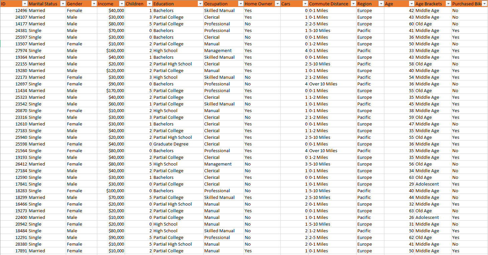
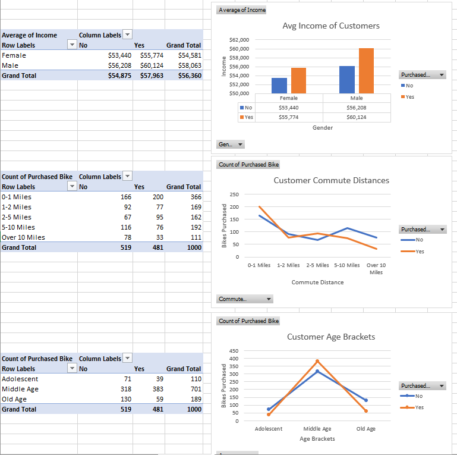
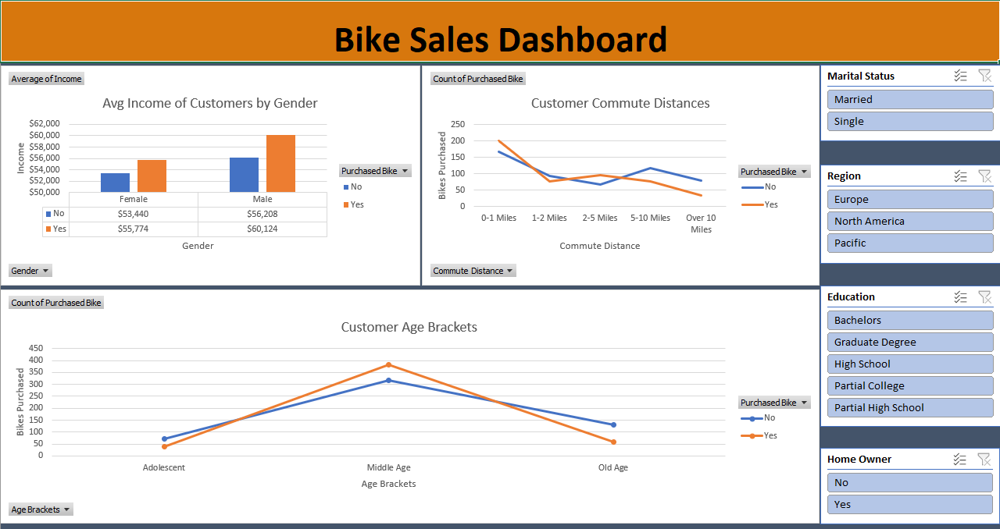

# Bike-Sales-Analysis
---
## Table of Contents
1. [Introduction](#introduction)
2. [About the Dataset](#about-the-dataset)
3. [Data Cleaning Process](#data-cleaning-process)
4. [Data Analysis and Visualization](#data-analysis-and-visualization)
5. [Dashboard](#dashboard)
6. [Findings](#findings)
7. [Significance](#significance)
8. [Author](#author)
9. [License](#license)

## Introduction
This project covers data cleaning, data analysis, and data visualization processes using Microsoft Excel. The main goal is to identify the factors contributing to the sales of bikes in an unknown store.

## About the Dataset
The dataset is sourced from GitHub and contains 1026 rows and 13 columns, including customer ID, marital status, gender, income, number of children, education, occupation, homeownership, number of cars, commute distance, region, age, and purchase status.

[Dataset Link](https://github.com/AlexTheAnalyst/Excel-Tutorial/blob/main/Excel%20Project%20Dataset.xlsx)

## Data Cleaning Process
1. **Duplicate Removal**: Duplicates were removed by selecting the whole dataset (`Ctrl+A`) and navigating to `Data > Remove Duplicate > Select All columns > OK`. This step removed 26 duplicates, leaving 1,000 unique entries.
   
2. **Find and Replace**: The `Marital Status` and `Gender` columns were cleaned by replacing shorthand notations like "M" and "F" with "Married" and "Female" respectively.

3. **New Column - Age Group**: A new column `Age_Group` was added using a nested IF statement. This column categorizes the customers into different age groups: Youth, Middle Age, and Old.

## Data Analysis and Visualization
1. **Pivot Tables**: Three pivot tables were created in a new sheet named "PivotTables".
   
2. **Charts**: Three different charts were created based on the pivot tables to visually understand the factors affecting bike sales.

3. **Interactive Slicers**: Slicers were added to make the dashboard more interactive and dynamic.

## Dashboard
The finalized dashboard presents a comprehensive view of bike sales and contributing factors. It includes slicers for dynamic interaction and various visual elements like charts and cards.

## Findings
- Male customers earn more and purchase more bikes.
- The middle age group dominates in both customer base and purchase volume.
- Customers living closer (0-1 miles) to the store make more purchases.

## Significance
1. **Business Insights**: The project provides valuable insights that can help the store owner in business decision-making.
  
2. **Data Analysis Skills**: This project serves as a comprehensive exercise in data cleaning, analysis, and visualization using Excel.

3. **Interactivity**: The use of slicers in the dashboard allows for dynamic data exploration.

## Author
**Farjad Tariq**

## License
This project is licensed under the MIT License - see the [LICENSE.md](LICENSE) file for details.

---
